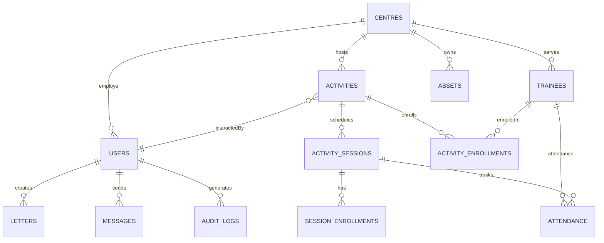

# CREAMS - Care Rehabilitation Centre Management System
## Codebase Documentation and Technical Analysis

**Document Type:** Technical Snapshot and Historical Record
**Generated:** December 21, 2025
**Repository Status:** Active Development (Fixers Branch)
**Purpose:** Evidence-based documentation of the codebase as it currently exists

---

## Document Status

**This documentation represents a factual analysis of the CREAMS codebase as found in the repository at the time of generation. It is not a product specification or roadmap.**

- **What this is:** A technical record, architectural analysis, and onboarding guide
- **What this is NOT:** A feature wishlist, marketing document, or implementation plan
- **Uncertainty:** Clearly marked with "**Assumption:**", "**Unclear:**", or "**Evidence suggests:**"

---

## Table of Contents

1. [Project Overview](#1-project-overview)
2. [Repository Structure](#2-repository-structure)
3. [System Architecture](#3-system-architecture)
4. [Core Features & Workflows](#4-core-features--workflows)
5. [Technical Assessment](#5-technical-assessment)
6. [Product & UX Observations](#6-product--ux-observations)
7. [Known Limitations & Open Questions](#7-known-limitations--open-questions)
8. [Development Context](#8-development-context)

---

## 1. Project Overview

### 1.1 What CREAMS Is

**CREAMS** stands for **Community-based REhAbilitation Management System** (or alternatively **Care Rehabilitation Centre Management System** based on configuration files).

**Evidence:** Package.json line 3, .env.example line 13, documentation files

This is a **full-stack web application** designed to manage operations across rehabilitation centers serving individuals with special needs in **Malaysia**. The system handles:

- Rehabilitation activity scheduling and management
- Trainee (client) enrollment and progress tracking
- Staff coordination and attendance
- Asset and resource inventory
- Communication (messages, notifications, letters)
- Multi-center data isolation and management

**Primary User Base (inferred from code):**
- Rehabilitation center administrators
- Supervisors and coordinators
- Teachers/instructors
- Committee members (AJK)
- Trainees and their parents/guardians

### 1.2 Project Maturity

**Current State:** **Active development with production-oriented features**

**Evidence:**
- Git branch: `Fixers` (bug fixing phase)
- Recent commit (Oct 23, 2025): "Fix profile page notification issues and enhance activity scheduling"
- Comprehensive UAT (User Acceptance Testing) documentation present
- 159+ blade view files, 58 models, 70+ controllers
- Extensive seeding data for realistic testing

**Development Timeline (from git history):**
- Initial development: December 2022 (Laravel 9)
- Major refactor: Mid-2025 (Laravel 10 upgrade)
- Current phase: October-December 2025 (bug fixes, UAT testing)

**Production Readiness:** **Not production-ready**
- Documentation explicitly states: "Production Ready: ❌ NO - Several bugs remain to be fixed"
- Active bug tracking in CREAMS_MASTER_DOCUMENTATION.md
- Pre-UAT manual testing tracker shows incomplete testing

---

## 2. Repository Structure

### 2.1 High-Level Directory Organization

```
CREAMS/
├── app/                          # Laravel application core
│   ├── Console/Commands/         # CLI commands (7 files)
│   ├── Exceptions/               # Custom exception handlers
│   ├── Extensions/               # Custom guards (MultipleUserGuard)
│   ├── Helpers/                  # Utility helpers (4 files)
│   ├── Http/
│   │   ├── Controllers/          # 70+ controllers
│   │   ├── Middleware/           # 21 middleware classes
│   │   └── Requests/             # Form request validation
│   ├── Mail/                     # Email templates
│   ├── Models/                   # 58 Eloquent models
│   ├── Providers/                # Service providers
│   ├── Rules/                    # Custom validation rules
│   ├── Services/                 # 16+ business logic services
│   ├── Traits/                   # 4 reusable traits
│   └── View/Components/          # Blade components
├── bootstrap/                    # Framework bootstrap
├── config/                       # 18 configuration files
├── database/
│   ├── factories/                # Test data factories
│   ├── migrations/               # 24 database migrations
│   └── seeders/                  # 17 database seeders
├── documentation/                # Extensive project documentation
│   ├── 01_System_Overview/
│   ├── 02_Module_Documentation/
│   ├── 03_Technical_Guides/
│   ├── 04_Deployment_Guides/
│   ├── 06_Status_Reports/
│   ├── 07_Fixes_and_Audits/
│   ├── 08_Development_Planning/
│   ├── 09_New_Features/
│   ├── 10_User_Manuals/
│   └── UAT FILES/
├── public/                       # Public web assets
│   ├── css/                      # Stylesheets
│   ├── js/                       # JavaScript files
│   ├── images/                   # Image assets
│   ├── fonts/                    # Custom fonts
│   └── avatars/                  # User profile images
├── resources/
│   ├── css/                      # Source CSS (Tailwind)
│   ├── js/                       # Source JavaScript
│   └── views/                    # 252+ Blade templates
├── routes/
│   ├── web.php                   # 1,073 lines, 406+ routes
│   └── api.php                   # API endpoints
├── storage/                      # Application storage
├── tests/                        # Test suite (minimal coverage)
├── vendor/                       # Composer dependencies
├── .env.example                  # Environment template
├── composer.json                 # PHP dependencies
├── package.json                  # Node dependencies
├── vite.config.js                # Frontend build config
└── CHANGELOG.md                  # Change tracking
```

### 2.2 Controller Organization

Controllers are organized by domain with significant size variance:

**Structure:**
```
app/Http/Controllers/
├── Activity/                     # Activity domain (9 controllers)
│   ├── ActivityController.php        (3,545 lines - LARGEST)
│   ├── ScheduleTemplateController.php
│   ├── SessionController.php
│   └── ...
├── Auth/                         # Authentication (8 controllers)
├── Centre/                       # Center management (3 controllers)
├── Dashboard/                    # Dashboard logic (1 controller)
│   └── DashboardController.php       (2,161 lines)
├── Letters/                      # Letter generation (2 controllers)
├── Profile/                      # User profiles (4 controllers)
├── Staff/                        # Staff management (5 controllers)
├── Trainee/                      # Trainee management (5 controllers)
├── AdminController.php           # Admin operations
├── ContactController.php         # Public contact form
├── MainController.php            # Legacy/core routes
├── MessageController.php         # Messaging system
├── NotificationController.php    # Notifications
├── VolunteerController.php       # Volunteer applications
└── [50+ more controllers]
```

**Size Distribution:**
- Largest: ActivityController.php (3,545 lines)
- 2nd: DashboardController.php (2,161 lines)
- Average: ~290 lines per file
- Smallest: <100 lines (various simple controllers)

**Concern:** Two controllers exceed 2,000 lines, suggesting violation of Single Responsibility Principle.

### 2.3 Model Architecture

**58 Models** representing the domain:

**User & Access Management:**
- User (base user model)
- Admin, Supervisor, Teacher, AJK (role-specific models)
- Trainee (rehabilitation participants)
- Volunteer

**Activity Management (14 models):**
- Activity
- ActivitySession
- ActivitySchedule, ActivityScheduleTemplate
- ActivityEnrollment
- ActivityAttendance
- ActivityLog
- ActivityCategory
- ActivityPrerequisite
- ActivityTemplateApplication
- LearningOutcome, SessionLearningOutcome
- IepActivityGoal
- TraineeEducationPlan

**Centre & Asset Management (11 models):**
- Centre
- Asset, AssetParent, AssetCategory, AssetCategories
- AssetLocation, AssetMaintenance, AssetMovement
- AssetEnhanced (legacy?)
- CentreStatistics, CentreAuditLog

**Communication (7 models):**
- Message, MessageTemplate, MessageCategory, MessageRecipient
- Letter, LetterTemplate
- Notification

**Additional:**
- Attendance, AttendanceAlert, StaffAttendance
- Event, Course, ClassModel
- ProgressReport, PublicHoliday
- AuditLog, ActivityLog
- ContactMessages

**Observation:** Some models show naming inconsistencies (AssetCategory vs AssetCategories, Asset vs AssetEnhanced) suggesting refactoring in progress.

### 2.4 Database Migrations

**24 migration files** organized chronologically:

**Foundation Migrations (2025-01-01 series):**
1. `create_creams_foundation_management_tables.php` - Core tables
2. `create_creams_client_management_tables.php` - Trainee tables
3. `create_creams_service_delivery_management_tables.php` - Activity tables
4. `create_creams_attendance_management_tables.php` - Attendance tracking
5. `create_creams_asset_management_tables.php` - Asset inventory
6. `create_creams_communication_management_tables.php` - Messages/letters
7. `create_creams_system_constraints.php` - Foreign keys

**Enhancement Migrations (2025-09-XX series):**
- Phone field standardization
- Password reset tables
- Jobs queue table
- Audit logging
- Volunteer approval workflow
- Activity category refactor
- Learning outcomes restructure
- Enrollment notes
- Asset management optimization
- Activity session defaults
- Database cleanup and optimization
- Public holidays
- Centre state field

**Pattern:** Multiple "fix" and "optimization" migrations suggest schema evolved through iterative refinement rather than upfront design.

### 2.5 Key Configuration Files

**Malaysian Customizations:**
- [config/malaysian.php](config/malaysian.php) - States, holidays, locale settings
- [config/trainee.php](config/trainee.php) - Trainee-specific configurations
- [config/performance.php](config/performance.php) - Performance tuning

**Standard Laravel:**
- [config/app.php](config/app.php) - Application config (modified)
- [config/database.php](config/database.php) - DB connection (MySQL)
- [config/auth.php](config/auth.php) - Custom session auth
- [config/mail.php](config/mail.php) - SMTP email (Gmail)

**Build Tools:**
- [package.json](package.json) - Vite, Tailwind CSS, Alpine.js, Bootstrap
- [composer.json](composer.json) - Laravel 10, DomPDF, Doctrine DBAL

---

## 3. System Architecture

### 3.1 Technology Stack

**Backend:**
- **Framework:** Laravel 10.8+
- **PHP Version:** 8.1 or 8.4
- **Database:** MySQL 8.0+ (database name: `cream`)
- **Authentication:** Custom session-based (NOT Laravel Auth)
- **PDF Generation:** barryvdh/laravel-dompdf ^3.1
- **HTTP Client:** Guzzle HTTP ^7.2

**Frontend:**
- **Build Tool:** Vite 6.2.0
- **CSS Framework:** Tailwind CSS 3.1.0 + Bootstrap 5.3.3 (mixed)
- **JavaScript:** Alpine.js 3.4.2 + jQuery 3.7.1 (mixed)
- **Templating:** Blade PHP
- **Icons:** Font Awesome

**Development Tools:**
- **Testing:** PHPUnit 10.1
- **Code Quality:** PHPStan ^1.12, Laravel Pint
- **Debugging:** Laravel Tinker
- **Containerization:** Laravel Sail

**Observation:** Mixed frontend stack (Tailwind + Bootstrap, Alpine + jQuery) suggests gradual migration or incomplete refactoring.

### 3.2 Authentication Architecture

**Custom Implementation - NOT Laravel Auth**

**Evidence:**
- Custom `SessionManager` service ([app/Services/SessionManager.php](app/Services/SessionManager.php))
- Custom `MultipleUserGuard` ([app/Extensions/MultipleUserGuard.php](app/Extensions/MultipleUserGuard.php))
- Session-based authentication using PHP sessions
- Custom middleware: `EnhancedAuthenticate`, `EnhancedRoleMiddleware`

**Session Variables:**
```php
session('id')        // User ID
session('role')      // User role: admin, supervisor, teacher, ajk, trainee, parent
session('name')      // Display name
session('centre_id') // Assigned center (for data isolation)
```

**Role Hierarchy:**
1. **Admin** - Full system access, create activities/sessions
2. **Supervisor** - Center-level management, team oversight
3. **Teacher** - Activity instruction, trainee interaction
4. **AJK** - Committee members, limited access
5. **Trainee** - Self-service access to personal data
6. **Parent** - Guardian access to trainee data

**Middleware Stack:**
- `enhanced.auth` - Enhanced authentication check
- `enhanced.role:admin,supervisor,teacher` - Role-based authorization
- `centre.access` - Center-based data isolation

### 3.3 Multi-Tenant Architecture

**Design Pattern:** Single database, center-based data isolation

**Implementation:**
- Centre model uses string primary key `centre_id`
- Foreign key `centre_id` on most domain tables (activities, trainees, assets, users)
- Middleware `CentreAccessControl` enforces isolation
- Query scope filtering: `->where('centre_id', session('centre_id'))`

**Example Isolation Pattern:**
```php
// Non-admin users only see data from their center
if (session('role') !== 'admin') {
    $query->where('centre_id', session('centre_id'));
}
```

**Centre Model Relationships:**
- Has many: Users, Activities, Trainees, Assets
- Isolated by: Middleware + Query scopes

### 3.4 Service Layer Architecture

**Pattern:** Domain-driven service classes with factory pattern

**16+ Services Identified:**

**Dashboard Services (Factory Pattern):**
```
DashboardServiceFactory
├── BaseDashboardService (abstract)
├── AdminDashboardService
├── SupervisorDashboardService
├── TeacherDashboardService
└── AjkDashboardService
```

**Domain Services:**
- AssetService, AssetManagementService, AssetRepositoryService
- TraineeService
- CentreService
- NotificationService
- ScheduleConflictService
- ErrorMonitoringService

**Caching Strategy:**
```php
Cache::remember('dashboard_stats_' . $userId, 300, function() {
    // Expensive queries cached for 5 minutes
});
```

**Location:** [app/Services/](app/Services/)

### 3.5 Database Schema Architecture

**Primary Tables (24 total):**

**Foundation:**
- `centres` - Multi-tenant centers (PK: centre_id - STRING)
- `users` - Staff and administrators
- `sessions` - PHP session storage

**Client Management:**
- `trainees` - Rehabilitation participants
- `volunteers` - Volunteer applicants
- `parents/guardians` - (Evidence unclear - may be in trainees table)

**Service Delivery:**
- `activities` - Rehabilitation programs
- `activity_sessions` - Scheduled sessions
- `activity_schedules` - Session scheduling
- `activity_enrollments` - Trainee enrollment
- `session_enrollments` - Session-level enrollment
- `learning_outcomes` - Educational goals
- `session_learning_outcomes` - Session-specific outcomes

**Attendance:**
- `attendance` - Trainee attendance records
- `staff_attendance` - Staff attendance
- `attendance_alerts` - Automated alerts

**Asset Management:**
- `asset_parents` - Asset hierarchy root
- `assets` - Individual assets
- `asset_categories` - Asset classification
- `asset_locations` - Storage locations
- `asset_maintenance` - Maintenance records
- `asset_movements` - Asset transfers

**Communication:**
- `messages` - Internal messaging
- `message_templates` - Message templates
- `notifications` - User notifications
- `letters` - Generated letters
- `letter_templates` - Letter templates
- `contact_messages` - Public contact submissions

**System:**
- `audit_logs` - System audit trail
- `activity_logs` - User activity logging
- `public_holidays` - Malaysian holidays
- `password_resets` - Password reset tokens
- `jobs` - Queue jobs

**Key Relationships:**
- Centre → Users (1:N)
- Centre → Activities (1:N)
- Centre → Trainees (1:N)
- Activity → Sessions (1:N)
- Activity → Enrollments (1:N)
- Session → Attendance (1:N)
- User → Letters (1:N)

**Schema Diagram (Simplified):**


### 3.6 Route Architecture

**Web Routes:** 1,073 lines, 406+ routes

**Route Organization:**
```php
// Public routes (no auth)
GET  /                          # Home page
GET  /contact                   # Contact form
GET  /volunteer                 # Volunteer application

// Authentication routes
POST /login                     # Login
POST /logout                    # Logout
GET  /forgot-password           # Password reset

// Authenticated routes (grouped by module)
GET  /dashboard                 # Role-based dashboard
GET  /profile                   # User profile

// Activity routes (admin/supervisor only for create/edit)
GET    /activities              # List activities
POST   /activities              # Create activity
GET    /activities/{id}         # View activity
PUT    /activities/{id}         # Update activity
DELETE /activities/{id}         # Delete activity
GET    /activities/{id}/sessions           # Activity sessions
GET    /activities/{id}/enrollments        # Enrolled trainees
POST   /activities/{id}/enroll             # Enroll trainee

// Trainee routes
GET    /trainees                # List trainees
POST   /trainees                # Register trainee
GET    /trainees/{id}           # Trainee profile
PUT    /trainees/{id}           # Update trainee

// Staff routes
GET    /staffs                  # List staff
POST   /staffs                  # Create staff
GET    /staffs/{id}             # Staff profile

// Centre routes
GET    /centres                 # List centers
GET    /centres/{id}            # Center details

// Asset routes
GET    /asset-parents           # Asset inventory
GET    /asset-parents/{id}      # Asset details

// Message routes
GET    /messages                # Message inbox
POST   /messages                # Send message

// Letter routes
GET    /letters/modern          # Letter generator
POST   /letters/modern/generate # Generate letter PDF
```

**Route Protection Pattern:**
```php
Route::middleware(['enhanced.auth'])->group(function () {
    Route::middleware(['enhanced.role:admin,supervisor'])->group(function () {
        // Admin/supervisor only routes
    });
});
```

**API Routes:**
```php
GET  /api/dashboard/stats              # Dashboard statistics
GET  /api/notifications/check          # Check notifications
GET  /api/search                       # Global search
GET  /api/health                       # System health check
```

---

## 4. Core Features & Workflows

### 4.1 Implemented Features

This section documents features confirmed through code examination.

#### 4.1.1 Activity Management

**Evidence:** [app/Http/Controllers/Activity/ActivityController.php](app/Http/Controllers/Activity/ActivityController.php:1) (3,545 lines), [app/Models/Activity.php](app/Models/Activity.php:1)

**Feature Set:**
- Create rehabilitation activities with categories
- Define learning outcomes and prerequisites
- Schedule recurring sessions using templates
- Enroll trainees in activities
- Track session attendance
- Mark sessions as completed
- Monitor activity progress and statistics

**Activity Categories (hardcoded enum):**
1. Autism Spectrum Support
2. Hearing Impairment
3. Visual Impairment
4. Physical Disabilities
5. Learning Support
6. Speech Therapy

**Workflow:**
```
1. Admin/Supervisor creates Activity
   ↓
2. Activity assigned to Teacher (instructor)
   ↓
3. Sessions scheduled (one-time or template-based)
   ↓
4. Trainees enrolled in activity
   ↓
5. Teacher conducts sessions
   ↓
6. Attendance marked per session
   ↓
7. Learning outcomes tracked
   ↓
8. Activity completion/progress reported
```

**Code Evidence:**
```php
// Activity model has comprehensive relationships
public function sessions()        # HasMany ActivitySession
public function enrollments()     # HasMany ActivityEnrollment
public function participants()    # BelongsToMany Trainee
public function instructor()      # BelongsTo User

// Scheduling features
public function generateSessionSchedule($template, $startDate, $customizations)
```

**Template System:**
- [app/Models/ActivityScheduleTemplate.php](app/Models/ActivityScheduleTemplate.php:1)
- Supports recurring session generation
- Customizable session times and duration
- Malaysian public holiday awareness

#### 4.1.2 Trainee Management

**Evidence:** [app/Http/Controllers/Trainee/TraineeController.php](app/Http/Controllers/Trainee/TraineeController.php:1), [app/Models/Trainee.php](app/Models/Trainee.php:1)

**Feature Set:**
- Trainee registration with personal details
- Medical history and emergency contacts
- Progress tracking across activities
- Individual Education Plans (IEPs)
- Document management
- Competency progress tracking
- Enrollment in multiple activities

**Workflow:**
```
1. Trainee Registration
   ↓
2. Assigned to Centre
   ↓
3. Medical/emergency info recorded
   ↓
4. IEP created (individualized goals)
   ↓
5. Enrolled in appropriate activities
   ↓
6. Progress tracked per learning outcome
   ↓
7. Competency levels updated (Not Started → In Progress → Achieved → Mastered)
   ↓
8. Reports generated
```

**Competency Tracking System:**
```php
// Evidence from Activity.php lines 578-661
Levels: Not Started → In Progress → Achieved → Mastered

Progress calculation:
- Session-based (attendance percentage)
- Outcome-based (learning outcome achievement)
```

**IEP System:**
- [app/Models/TraineeEducationPlan.php](app/Models/TraineeEducationPlan.php:1)
- [app/Models/IepActivityGoal.php](app/Models/IepActivityGoal.php:1)
- Links activities to personalized goals

#### 4.1.3 Staff Management

**Evidence:** [app/Http/Controllers/Staff/StaffController.php](app/Http/Controllers/Staff/StaffController.php:1) (1,183 lines)

**Feature Set:**
- Staff registration and role assignment
- Centre assignment
- Schedule management
- Attendance tracking for staff
- Activity instruction assignment
- Performance statistics (real data, not hardcoded per docs)

**Roles Supported:**
- Admin (superuser)
- Supervisor (center manager)
- Teacher (activity instructor)
- AJK (committee member)

**Workflow:**
```
1. Admin creates staff account
   ↓
2. Assign role and center
   ↓
3. Staff logs in with credentials
   ↓
4. Role-based dashboard presented
   ↓
5. Staff performs role-specific tasks
   ↓
6. Attendance marked (staff)
   ↓
7. Performance tracked
```

#### 4.1.4 Attendance System

**Evidence:** [app/Http/Controllers/StaffAttendanceController.php](app/Http/Controllers/StaffAttendanceController.php:1), [app/Models/Attendance.php](app/Models/Attendance.php:1)

**Dual System:**

**Trainee Attendance:**
- Marked per activity session
- Status: Present, Absent, Late, Excused
- Linked to session enrollments
- Affects progress calculations

**Staff Attendance:**
- Daily check-in/check-out
- Work hours tracking
- Absence reporting
- Alerts for missing attendance

**Evidence:**
```php
// Two separate tables
attendance           # Trainee attendance per session
staff_attendance     # Staff daily attendance
```

#### 4.1.5 Asset Management

**Evidence:** [app/Http/Controllers/Centre/AssetController.php](app/Http/Controllers/Centre/AssetController.php:1), [app/Models/AssetParent.php](app/Models/AssetParent.php:1)

**Feature Set:**
- Asset inventory with hierarchical categorization
- Asset location tracking
- Maintenance scheduling and history
- Asset movement/lending tracking
- Condition monitoring (Good, Fair, Poor, Damaged)
- Status tracking (Available, In Use, Under Maintenance, Retired)

**Hierarchical Structure:**
```
AssetParent (top-level category)
  └── Asset (individual items)
        ├── AssetCategory
        ├── AssetLocation
        ├── AssetMaintenance (history)
        └── AssetMovement (transfer history)
```

**Workflow:**
```
1. Create asset parent category
   ↓
2. Add individual assets
   ↓
3. Assign location
   ↓
4. Track usage/movements
   ↓
5. Schedule maintenance
   ↓
6. Update condition
   ↓
7. Generate asset reports
```

**Note:** Evidence of refactoring - git history shows "Renamed assets to asset-parents" (commit a93487d).

#### 4.1.6 Communication System

**Messaging:**
- Internal messaging between users
- Message templates for common communications
- Read/unread status tracking
- Message categories

**Notifications:**
- System notifications for events
- Bell icon with unread count
- Real-time notification checking (AJAX)
- Notification clearing

**Letters:**
- PDF letter generation using DomPDF
- Customizable letter templates
- Template variables (name, date, center, etc.)
- Letter archive with download capability
- Modern letter builder UI

**Evidence:**
- [app/Http/Controllers/MessageController.php](app/Http/Controllers/MessageController.php:1)
- [app/Http/Controllers/NotificationController.php](app/Http/Controllers/NotificationController.php:1)
- [app/Http/Controllers/Letters/ModernLetterController.php](app/Http/Controllers/Letters/ModernLetterController.php:1)

#### 4.1.7 Dashboard System

**Evidence:** [app/Http/Controllers/Dashboard/DashboardController.php](app/Http/Controllers/Dashboard/DashboardController.php:1) (2,161 lines), [app/Services/Dashboard/](app/Services/Dashboard/)

**Role-Based Dashboards:**

**Admin Dashboard:**
- System-wide statistics
- All centers overview
- User management access
- Activity statistics across all centers
- Recent activity logs

**Supervisor Dashboard:**
- Center-specific statistics
- Staff oversight
- Activity monitoring for assigned center
- Trainee progress overview
- Attendance summaries

**Teacher Dashboard:**
- Assigned activities
- Upcoming sessions
- Enrolled trainees
- Personal schedule
- Attendance marking shortcuts

**AJK Dashboard:**
- Limited view
- Committee-relevant information
- Basic statistics

**Trainee Dashboard:**
- Personal schedule
- Enrolled activities
- Progress tracking
- Attendance history

**Parent Dashboard:**
- Child's progress
- Activity enrollments
- Attendance records
- Communication with staff

**Widget System:**
- Calendar view of activities
- Upcoming sessions widget
- Notifications widget
- Quick actions widget
- Statistics cards (real-time data)

**Evidence:**
```php
// Factory pattern for role-specific dashboards
DashboardServiceFactory::create($role)
  ->getDashboardData($userId, $centreId)
```

#### 4.1.8 Public-Facing Features

**Home Page:**
- Video background hero section
- Organization structure display
- Leadership team with images
- Responsive design with animations
- **Status:** Production-ready (per documentation)

**Contact Form:**
- Multi-step form with validation
- Email confirmation to submitter
- Admin notification email
- Success/failure messages
- AJAX submission
- **Status:** Production-ready (per documentation)

**Volunteer Application:**
- Multi-step volunteer registration
- Centre selection
- Skill/availability capture
- Email confirmation system
- Admin approval workflow (approve/reject)
- Status tracking (pending, approved, rejected)
- **Status:** Production-ready (per documentation)

**Evidence:**
- [resources/views/home.blade.php](resources/views/home.blade.php:1)
- [resources/views/contactus.blade.php](resources/views/contactus.blade.php:1)
- [resources/views/volunteers/home.blade.php](resources/views/volunteers/home.blade.php:1)
- [app/Http/Controllers/ContactController.php](app/Http/Controllers/ContactController.php:1)
- [app/Http/Controllers/VolunteerController.php](app/Http/Controllers/VolunteerController.php:1)

### 4.2 Workflow Examples (Evidence-Based)

#### Workflow 1: Activity Creation and Session Delivery

**Based on:** ActivityController.php, Activity.php, ActivitySession.php

```
Step 1: Admin/Supervisor Creates Activity
├── Navigate to /activities
├── Click "Create Activity"
├── Fill form:
│   ├── Activity name
│   ├── Description
│   ├── Category (dropdown: 6 categories)
│   ├── Duration (weeks)
│   ├── Sessions per week
│   ├── Session duration (minutes)
│   ├── Max participants
│   ├── Learning outcomes
│   ├── Location
│   └── Assign instructor (teacher)
└── Submit → Activity created

Step 2: Schedule Sessions
├── Option A: Manual session creation
│   └── Add individual sessions with date/time
├── Option B: Template-based scheduling
│   ├── Select template (recurring pattern)
│   ├── Set start date
│   ├── System generates sessions automatically
│   └── Respects Malaysian public holidays
└── Sessions created with status "scheduled"

Step 3: Trainee Enrollment
├── Navigate to activity details
├── Click "Enroll Trainees"
├── Select trainees (with prerequisite check)
├── Set enrollment date
└── Enrollment created with status "enrolled"

Step 4: Session Delivery
├── Teacher logs in
├── Dashboard shows upcoming sessions
├── Navigate to session details
├── Mark attendance:
│   ├── Present
│   ├── Absent
│   ├── Late
│   └── Excused
├── Track learning outcome progress per trainee
└── Mark session as "completed"

Step 5: Progress Tracking
├── System calculates:
│   ├── Attendance percentage
│   ├── Learning outcome achievement
│   ├── Overall progress percentage
│   └── Competency levels (Not Started → Mastered)
└── Reports generated for admin/supervisor/teacher
```

**Evidence:**
- ActivityController::store() - Activity creation
- ActivityController::sessions() - Session management
- ActivityController::enrollments() - Enrollment management
- Activity::generateSessionSchedule() - Template scheduling
- Activity::getTraineeProgress() - Progress calculation

#### Workflow 2: Trainee Lifecycle

**Based on:** TraineeController.php, Trainee.php, TraineeEducationPlan.php

```
Step 1: Registration
├── Navigate to /trainees/create
├── Fill registration form:
│   ├── Personal details (name, IC, DOB)
│   ├── Contact information (phone - Malaysian format)
│   ├── Address
│   ├── Emergency contacts
│   ├── Medical history
│   └── Assigned center
└── Submit → Trainee account created

Step 2: IEP Creation
├── Navigate to trainee profile
├── Create Individual Education Plan (IEP)
├── Define personalized goals
└── Link goals to activities

Step 3: Activity Enrollment
├── Browse available activities
├── Check prerequisites (if any)
├── Enroll in suitable activities
└── Enrollment confirmed

Step 4: Attendance & Participation
├── Trainee attends sessions
├── Teacher marks attendance
└── Participation recorded

Step 5: Progress Monitoring
├── Learning outcomes tracked per activity
├── Competency levels updated
├── Session-based or outcome-based progress
└── Progress visible to:
    ├── Trainee (own dashboard)
    ├── Parent (parent dashboard)
    ├── Teacher (instructor view)
    └── Admin/Supervisor (reports)

Step 6: Reporting
├── Generate progress reports
├── View attendance history
├── Track IEP goal achievement
└── Export data (if implemented)
```

**Evidence:**
- TraineeController::store() - Registration
- TraineeEducationPlan model - IEP system
- Activity::getTraineeProgress() - Progress tracking
- Competency levels: [Activity.php:578-661](app/Models/Activity.php:578)

---

## 5. Technical Assessment

### 5.1 Software Architecture Observations

#### Strengths

**1. Service Layer Implementation**
- Well-defined service classes separate business logic from controllers
- Factory pattern for role-based dashboards shows good OOP design
- Caching strategy implemented (5-minute TTL on expensive queries)

**Location:** [app/Services/](app/Services/)

**2. Malaysian Localization**
- Comprehensive Malaysian holiday system ([MalaysiaHolidays.php](app/Helpers/MalaysiaHolidays.php:1))
- Phone number validation for Malaysian formats
- Timezone: Asia/Kuala_Lumpur
- State list (16 Malaysian states)

**3. Multi-Tenant Data Isolation**
- Centre-based filtering enforced at multiple layers:
  - Middleware: CentreAccessControl
  - Query scopes: ->byCentre()
  - Session checks: session('centre_id')

**4. Query Optimization**
- Eager loading patterns (->with() used 708 times)
- Query scopes for reusable filters (45+ scopes)
- Database indexing on foreign keys

**5. Comprehensive Documentation**
- 90+ documentation files in `/documentation/`
- User manuals for all roles
- Technical guides
- UAT testing documentation

#### Weaknesses & Concerns

**1. Controller Size (Critical)**
- ActivityController: 3,545 lines (violates SRP)
- DashboardController: 2,161 lines (too many responsibilities)
- Recommendation: Refactor into smaller, focused controllers

**Files:**
- [app/Http/Controllers/Activity/ActivityController.php](app/Http/Controllers/Activity/ActivityController.php:1)
- [app/Http/Controllers/Dashboard/DashboardController.php](app/Http/Controllers/Dashboard/DashboardController.php:1)

**2. Testing Coverage (Critical)**
- Only 9 actual test files for 70+ controllers
- Coverage ratio: ~13%
- Most test files are manual scripts, not automated tests
- Critical domains untested: Activity, Dashboard, Asset, Services

**Location:** [tests/](tests/)

**3. Middleware Duplication**
- Multiple implementations of similar concerns:
  - Role.php, RoleMiddleware.php, EnhancedRoleMiddleware.php
  - Authenticate.php, EnhancedAuthenticate.php
  - ErrorHandler.php, ErrorHandlingMiddleware.php, ApiErrorHandlingMiddleware.php

**Total middleware files:** 21

**4. Model Naming Inconsistencies**
- AssetCategory vs AssetCategories (plural form)
- Asset vs AssetEnhanced (likely legacy)
- Suggests incomplete refactoring

**5. Mixed Frontend Stack**
- Tailwind CSS + Bootstrap 5 (competing frameworks)
- Alpine.js + jQuery (competing approaches)
- Suggests gradual migration not completed

**6. Debug Code in Production**
- error_log() calls with session data in controllers
- DEBUG comments and logging statements
- TODO comments for incomplete features (email notifications)

**Examples:**
- [app/Services/ErrorMonitoringService.php:153](app/Services/ErrorMonitoringService.php:153) - "TODO: Implement actual email sending"
- [app/Http/Controllers/Activity/ActivityController.php:1050](app/Http/Controllers/Activity/ActivityController.php:1050) - error_log with session data

**7. Database Schema Evolution**
- 24 migrations with multiple "fix" and "optimization" passes
- Suggests schema not fully planned upfront
- Risk of migration dependency issues

### 5.2 Code Quality Metrics

**Codebase Size:**
- Total PHP files: 207
- Total lines of code: ~59,987
- Average file size: 290 lines
- Largest file: 3,545 lines (ActivityController)

**Documentation:**
- Inline code comments: Present in critical sections
- PHPDoc blocks: Inconsistent coverage
- API documentation: Absent
- User documentation: Extensive (90+ markdown files)

**Complexity:**
- Cyclomatic complexity: High in large controllers
- Nesting levels: Acceptable in most code
- Method length: Variable (some methods >100 lines)

### 5.3 Security Assessment

**Positive:**
- CSRF protection enabled (VerifyCsrfToken middleware)
- Password fields hidden in models
- ID encryption trait available (HandlesEncryptedIds)
- Role-based authorization middleware
- SQL injection prevention via Eloquent ORM
- Input validation via Form Requests

**Concerns:**
- Custom authentication (not using Laravel Auth) - potential security risk if not properly implemented
- Session data exposed in debug logs (error_log calls)
- Multiple authentication middleware suggests complexity

**Unclear:**
- XSS prevention strategy in Blade templates
- CORS configuration for API routes
- Rate limiting implementation (mentioned in .env but not verified in code)

### 5.4 Performance Considerations

**Optimizations Present:**
- Query caching (Cache::remember with 5-min TTL)
- Eager loading to prevent N+1 queries
- Database indexes on foreign keys
- Query scopes for efficient filtering

**Potential Bottlenecks:**
- Large controllers may have slow response times
- Dashboard services perform many queries (mitigated by caching)
- No evidence of queue system for async tasks (queue connection: sync)
- View rendering for 252 blade templates (no view caching evident)

**Scalability:**
- Multi-tenant design supports horizontal scaling
- MySQL database may need optimization for large datasets
- No evidence of load balancing or caching layers (Redis configured but unused?)

### 5.5 Maintainability Assessment

**Positive:**
- Clear directory structure by domain
- Service layer separation
- Trait usage for cross-cutting concerns
- Comprehensive external documentation

**Negative:**
- Large controllers difficult to maintain
- Inconsistent naming conventions
- Mixed frontend frameworks
- Commented code not removed
- TODO items not tracked systematically

**Technical Debt Estimate:** Medium to High
- Refactoring needed: Large controllers, middleware consolidation, model naming
- Testing debt: ~87% of codebase untested
- Frontend migration: Incomplete Tailwind/Alpine transition

### 5.6 Deployment Readiness

**Current Status:** NOT production-ready

**Evidence:**
- Documentation states: "Production Ready: ❌ NO"
- Active bug tracking in CREAMS_MASTER_DOCUMENTATION.md
- UAT testing incomplete (PRE_UAT_MANUAL_TESTING_TRACKER.md)
- Git branch: "Fixers" (bug fixing phase)

**Blockers to Production:**
1. Incomplete testing (13% coverage)
2. Known bugs documented but unfixed
3. Debug code still present
4. Email notifications incomplete (TODO in ErrorMonitoringService)
5. Schema stability (multiple fix migrations suggest instability)

**Deployment Configuration Available:**
- AWS deployment guide
- Vercel deployment guide
- Docker configuration (Laravel Sail)
- Environment configuration (.env.example)

**Missing:**
- CI/CD pipeline configuration
- Automated testing in deployment pipeline
- Performance benchmarks
- Load testing results

---

## 6. Product & UX Observations

### 6.1 User-Facing Functionality

This section documents the actual user experience based on views, routes, and controller logic.

#### Public Website Features

**Home Page** ([resources/views/home.blade.php](resources/views/home.blade.php:1))
- Video background hero section
- Organization overview
- Leadership team showcase with images
- Responsive design with animations
- **UX Assessment:** Production-quality, professionally designed

**Contact Form** ([resources/views/contactus.blade.php](resources/views/contactus.blade.php:1))
- Multi-step form flow
- Client-side validation
- Success/error messaging
- Email confirmation
- **UX Assessment:** Well-implemented, user-friendly

**Volunteer Application** ([resources/views/volunteers/home.blade.php](resources/views/volunteers/home.blade.php:1))
- Step-by-step application process
- Centre selection
- Skill assessment
- Availability scheduling
- **UX Assessment:** Comprehensive, guided process

#### Authenticated User Interfaces

**Dashboard Variations** (Evidence: 252 blade files, role-based routing)

Each role sees a customized dashboard:
- Admin: System-wide analytics, all-center view
- Supervisor: Center-specific management
- Teacher: Activity-focused with session shortcuts
- AJK: Limited committee view
- Trainee: Personal schedule and progress
- Parent: Child's activities and progress

**Activity Management UI**
- List view with filtering
- Detailed activity cards
- Session calendar view
- Enrollment management interface
- Attendance marking forms

**Trainee Management UI**
- Registration wizard
- Profile management
- Progress dashboards
- IEP creation interface
- Document upload (capability exists, unclear if implemented)

**Asset Management UI**
- Hierarchical asset browser
- Maintenance scheduling forms
- Location tracking
- Condition status updates

**Communication Interfaces**
- Message inbox/outbox
- Notification bell icon
- Letter generator with template selection
- Letter archive with download links

### 6.2 UX Patterns Observed

**Consistent Patterns:**
- Bootstrap-based layouts (with Tailwind gradual adoption)
- Font Awesome icons throughout
- Modal dialogs for confirmations
- AJAX form submissions (some pages)
- Flash messages for success/error feedback

**Inconsistent Patterns:**
- Some pages use Tailwind utility classes
- Others use Bootstrap components
- Mixed jQuery and Alpine.js usage
- Suggests UI in transition state

### 6.3 Gaps Between Implemented and Implied Features

This section identifies features that are partially implemented or show incomplete workflows.

**1. Email Notification System**
- **Implemented:** Email service configuration, mail views
- **Gap:** ErrorMonitoringService has "TODO: Implement actual email sending" ([line 153](app/Services/ErrorMonitoringService.php:153))
- **Impact:** System may not send automated error notifications

**2. Password Reset Flow**
- **Implemented:** Password reset controllers and views
- **Gap:** Documentation mentions "Password reset functionality issues" as known bug
- **Evidence:** Password reset table naming inconsistencies noted in docs

**3. File Upload System**
- **Implemented:** MediaUploadHelper exists
- **Unclear:** Where documents are stored, if S3 is configured
- **Evidence:** AWS_BUCKET in .env.example is empty

**4. Reporting & Analytics**
- **Implemented:** Dashboard statistics, progress tracking
- **Gap:** No evidence of exportable reports (PDF/Excel/CSV)
- **Unclear:** Whether reports can be printed or exported

**5. Queue System**
- **Configuration:** Queue table migration exists, QUEUE_CONNECTION=sync
- **Gap:** No evidence of async processing for heavy tasks
- **Impact:** Long-running operations may block requests

**6. Search Functionality**
- **Implemented:** SearchController exists, API route for /api/search
- **Unclear:** Scope of search (global? per module?), search quality

**7. Audit Trail**
- **Implemented:** audit_logs table, AuditLog model
- **Unclear:** What actions are logged, retention policy

### 6.4 User Flow Analysis

**Onboarding Flow (Staff):**
```
1. Admin creates staff account →
2. Staff receives credentials (unclear if email sent) →
3. Staff logs in →
4. Redirected to role-based dashboard →
5. Staff completes profile (assumption) →
6. Staff performs role-specific tasks
```

**Onboarding Flow (Trainee):**
```
1. Staff registers trainee →
2. Trainee account created →
3. Login credentials provided (unclear how) →
4. Trainee logs in →
5. Trainee dashboard shows enrolled activities →
6. Parent can also access (separate login)
```

**Activity Lifecycle:**
```
1. Admin/Supervisor creates activity →
2. Assigns teacher →
3. Schedules sessions →
4. Opens enrollment →
5. Trainees enroll →
6. Sessions conducted →
7. Attendance marked →
8. Progress tracked →
9. Activity completed →
10. Reports generated (unclear)
```

### 6.5 Accessibility Observations

**Positive:**
- Semantic HTML in blade templates (forms, tables, headings)
- Bootstrap accessibility features
- Form labels associated with inputs

**Unknown/Not Verified:**
- Keyboard navigation support
- Screen reader compatibility
- ARIA labels on interactive elements
- Color contrast ratios
- Focus indicators

**Note:** No automated accessibility testing found in test suite.

### 6.6 Mobile Responsiveness

**Evidence of Responsive Design:**
- Bootstrap grid system used
- Tailwind responsive utilities present
- Viewport meta tags in layouts
- Mobile-specific CSS classes observed

**Unclear:**
- Touch-friendly interface elements
- Mobile-specific workflows
- Performance on mobile devices
- PWA capabilities

### 6.7 Internationalization (i18n)

**Current State:**
- Primary language: English (observed in views)
- Malaysian context throughout (dates, phone formats, holidays)
- No evidence of multi-language support
- Hardcoded English strings in views

**Malaysian Localization:**
- Date format: d/m/Y (Malaysian standard)
- Phone validation: Malaysian number formats
- Timezone: Asia/Kuala_Lumpur
- States: 16 Malaysian states configured
- Public holidays: Malaysian calendar integrated

---

## 7. Known Limitations & Open Questions

### 7.1 Known Limitations (From Code Evidence)

**1. Single-Database Multi-Tenancy**
- **Limitation:** All centers share one database
- **Risk:** Data leakage if center isolation fails
- **Mitigation:** Centre_id filtering enforced at multiple layers

**2. Custom Authentication**
- **Limitation:** Not using Laravel's built-in Auth
- **Risk:** Potential security vulnerabilities if implementation flawed
- **Unknown:** Full security audit status

**3. Synchronous Queue**
- **Limitation:** QUEUE_CONNECTION=sync (no async processing)
- **Impact:** Long-running tasks block requests (PDF generation, email sending)

**4. Mixed Frontend Stack**
- **Limitation:** Bootstrap + Tailwind, jQuery + Alpine.js
- **Impact:** Larger bundle size, inconsistent UX
- **Status:** Appears to be in transition

**5. Limited Test Coverage**
- **Limitation:** Only 13% test coverage
- **Impact:** High regression risk when making changes
- **Critical:** Large controllers entirely untested

**6. Session-Based Authentication**
- **Limitation:** PHP sessions (not stateless)
- **Impact:** Difficult to scale horizontally without sticky sessions or shared session storage

### 7.2 Missing Components (Evidence Suggests Should Exist)

**1. API Authentication**
- API routes exist (/api/dashboard/stats, /api/notifications/check)
- No evidence of API token authentication (Sanctum installed but unused?)

**2. Real-Time Features**
- Pusher configuration in .env.example
- No WebSocket or broadcasting implementation found
- Notifications appear to be AJAX-polled, not real-time

**3. Automated Backups**
- No backup scripts found
- No backup scheduling in artisan commands

**4. Data Export**
- No evidence of CSV/Excel export functionality
- Reports appear to be view-only

**5. Bulk Operations**
- No bulk enrollment functionality found
- No bulk attendance marking
- Manual one-by-one operations

**6. Mobile App**
- No mobile app codebase
- No API specifically designed for mobile consumption

### 7.3 Open Questions for Future Developers

These questions could not be definitively answered from code analysis alone:

**Functional Questions:**

1. **Password Reset:** Is the password reset flow fully functional? Documentation mentions issues.

2. **Email Sending:** Are emails actually being sent? ErrorMonitoringService has TODOs.

3. **File Storage:** Where are uploaded files stored? S3 configured but bucket empty in .env.example.

4. **Report Export:** Can users export reports to PDF/Excel/CSV?

5. **Bulk Operations:** How do staff enroll 30+ trainees in an activity? One by one?

6. **Search Quality:** What does the global search actually search? How relevant are results?

7. **Notification Delivery:** Are notifications sent via email? SMS? In-app only?

8. **Audit Logging:** What actions trigger audit logs? Where can admin view them?

**Technical Questions:**

9. **Database Performance:** How does the system perform with 1000+ trainees? 100+ activities?

10. **Session Scaling:** How would this scale to 10+ concurrent centers? Session storage strategy?

11. **Caching Strategy:** Is Redis actually being used? Configured but unclear if active.

12. **API Usage:** Who consumes the API routes? Is there a separate frontend app?

13. **Sanctum Purpose:** Laravel Sanctum installed - for what purpose? API tokens unused?

14. **Asset vs AssetEnhanced:** Why two Asset models? Which is active?

15. **Migration Stability:** Can the database be freshly migrated without errors?

**Security Questions:**

16. **Penetration Testing:** Has the custom auth system been security audited?

17. **Data Encryption:** Is sensitive data (medical records) encrypted at rest?

18. **Access Logs:** Are failed login attempts logged and monitored?

19. **SQL Injection:** Has the system been tested for SQL injection (beyond Eloquent's protection)?

**Product Questions:**

20. **User Onboarding:** How are new users notified of their credentials?

21. **Trainee Lifecycle:** What happens when a trainee completes all activities? Graduation process?

22. **Activity Archival:** How are old/completed activities archived?

23. **Data Retention:** How long are attendance records kept? Audit logs?

### 7.4 Incomplete Implementations (Code Evidence)

**Based on TODO comments and debug code:**

1. **ErrorMonitoringService Email** ([line 153](app/Services/ErrorMonitoringService.php:153))
   ```php
   // TODO: Implement actual email sending
   ```

2. **ActivityController Debug Logging** ([line 1050](app/Http/Controllers/Activity/ActivityController.php:1050))
   ```php
   error_log("SESSIONS METHOD DEBUG: ID=$id, User=" . session('name'));
   ```
   - Should be removed before production

3. **StaffController Debug Logging** ([line 600](app/Http/Controllers/Staff/StaffController.php:600))
   ```php
   Log::info('DEBUG: Staff Schedule Data', [...]);
   ```
   - Debug code still present

**Based on commented code:**

4. **CentreController Assets Method** (commented out)
   - Functionality exists but disabled
   - Reason unclear

### 7.5 Schema Stability Concerns

**Migration Pattern Analysis:**

Initial Schema (2025-01-01 series):
```
1. create_creams_foundation_management_tables.php
2. create_creams_client_management_tables.php
3. create_creams_service_delivery_management_tables.php
4. create_creams_attendance_management_tables.php
5. create_creams_asset_management_tables.php
6. create_creams_communication_management_tables.php
7. create_creams_system_constraints.php
```

Fix/Enhancement Migrations (2025-09-XX series):
```
8. update_phone_fields_to_malaysian_format.php
9. create_password_resets_table.php
10. create_jobs_table.php
11. create_audit_logs_table.php
12. update_volunteers_table_remove_occupation_add_approval_fields.php
13. drop_activity_categories_and_add_category_to_activities.php
14. fix_learning_outcomes_and_remove_times_conducted.php
15. add_enrollment_and_completion_notes_to_activity_enrollments.php
16. add_current_participants_to_activity_sessions_and_fix_enrolled_by.php
17. fix_enrolled_by_foreign_key_and_populate_data.php
18. optimize_asset_management_tables.php
19. improve_activity_sessions_defaults.php
20. final_database_cleanup_and_optimization.php
21. create_activity_logs_table.php
22. add_user_role_to_activity_logs_table.php
23. create_public_holidays_table.php
24. add_state_to_centres_table.php
```

**Concern:** Many "fix" migrations suggest:
- Schema not fully planned upfront
- Iterative discovery of requirements
- Potential for migration dependency issues
- Risk when running fresh migrations

**Recommendation:** After stabilization, consider consolidating into fewer migrations.

---

## 8. Development Context

### 8.1 Project History

**Timeline (from git commits and file dates):**

**December 2022:**
- Initial Laravel 9 project created
- Basic authentication setup
- Database foundation

**Mid-2023:**
- Core module development
- Activity and trainee management
- Asset management initial implementation

**Early 2025:**
- Laravel 10 upgrade
- Database schema refactoring
- Malaysian localization added

**Mid-2025:**
- Enhanced features development
- Dashboard services refactor
- Testing infrastructure setup

**October-December 2025:**
- Bug fixing phase (Fixers branch)
- UAT preparation
- Documentation creation
- Production readiness assessment

**Current State (December 2025):**
- Active development on Fixers branch
- Pre-production testing phase
- Known bugs being addressed

### 8.2 Development Team Insights

**Evidence of Team Size:**
- Single main developer likely (commit patterns)
- AI assistance used extensively (Claude AI integration, .claude folder)
- Extensive documentation suggests onboarding preparation

**Development Approach:**
- Iterative development (many fix migrations)
- Documentation-driven (90+ doc files)
- UAT-focused (comprehensive test plans)
- Quality-conscious (PHPStan, Pint, SonarQube configured)

**Technology Choices:**
- Modern Laravel (10.x)
- Mixed frontend (gradual migration to Tailwind/Alpine)
- Custom auth (deliberate choice over Laravel Auth)
- Malaysian context (localized from the start)

### 8.3 Git Repository Status

**Current Branch:** Fixers

**Recent Commits (5 most recent):**
```
47a44b1 - Fix profile page notification issues and enhance activity scheduling
1215ca3 - Add UAT testing documentation
2d24a75 - Update contact page styles and error pagination UI
cc65faf - Merge
a93487d - Renamed assets to asset-parents
```

**Uncommitted Changes:**
```
M app/Exceptions/Handler.php
M app/Providers/CustomAuthServiceProvider.php
M config/app.php
M package-lock.json
```

**Untracked Files (numerous):**
- Text files with notes and documentation
- Testing artifacts
- Claude AI prompts and outputs
- Screenshots

### 8.4 External Dependencies

**PHP Dependencies (composer.json):**
```json
{
  "require": {
    "php": "^8.1 || ^8.4",
    "laravel/framework": "^10.8",
    "laravel/sanctum": "^3.2",
    "laravel/tinker": "^2.8",
    "barryvdh/laravel-dompdf": "^3.1",
    "doctrine/dbal": "^3.9",
    "guzzlehttp/guzzle": "^7.2"
  },
  "require-dev": {
    "laravel/breeze": "^1.29",
    "laravel/pint": "^1.0",
    "laravel/sail": "^1.18",
    "phpunit/phpunit": "^10.1",
    "phpstan/phpstan": "^1.12",
    "nunomaduro/larastan": "*"
  }
}
```

**Node Dependencies (package.json):**
```json
{
  "devDependencies": {
    "vite": "^6.2.0",
    "laravel-vite-plugin": "^1.1.1",
    "tailwindcss": "^3.1.0",
    "@tailwindcss/forms": "^0.5.2",
    "alpinejs": "^3.4.2"
  },
  "dependencies": {
    "bootstrap": "^5.3.3",
    "jquery": "^3.7.1"
  }
}
```

**Key Dependencies Purpose:**
- **Laravel Framework:** Core MVC framework
- **Laravel Sanctum:** API token authentication (installed but usage unclear)
- **DomPDF:** PDF generation for letters
- **Doctrine DBAL:** Database abstraction for migrations
- **Guzzle:** HTTP client (purpose unclear)
- **PHPStan/Larastan:** Static analysis for code quality
- **Laravel Pint:** Code formatting
- **Laravel Sail:** Docker development environment
- **Tailwind CSS:** Utility-first CSS framework
- **Alpine.js:** Lightweight JavaScript framework
- **Bootstrap 5:** UI component framework (legacy?)
- **jQuery:** JavaScript library (legacy?)

### 8.5 Infrastructure & Deployment

**Deployment Guides Available:**
- AWS deployment guide (documentation/04_Deployment_Guides/AWS_DEPLOYMENT_MIGRATION_GUIDE.md)
- Vercel deployment guide
- General deployment guide

**Server Requirements (from composer.json):**
- PHP 8.1 or 8.4
- MySQL 8.0+
- Composer
- Node.js & npm
- Web server (Apache/Nginx)

**Development Tools:**
- Laravel Sail (Docker)
- Vite (asset building)
- Laravel Pint (code formatting)
- PHPStan (static analysis)
- SonarQube (quality scanning - sonar-project.properties exists)

**Deployment Scripts:**
- deploy.sh (deployment automation)
- automation_script.sh (testing automation)

**Missing:**
- CI/CD pipeline configuration (.github/workflows/ not found)
- Automated deployment to staging/production
- Infrastructure as Code (Terraform, CloudFormation, etc.)

### 8.6 Documentation Assets

**Extensive Documentation (90+ markdown files):**

**System Overview:**
- CREAMS_MASTER_DOCUMENTATION.md (200+ lines, comprehensive)
- TECHNICAL_ARCHITECTURE.md (150+ lines)
- UPDATED_CREAMS_NAMING_STRUCTURE.md

**Module Documentation (11 files):**
- Activities, Assets, Attendance, Centres, Dashboard, Letters, Messages, Trainees, Users/Profile

**Technical Guides (9 files):**
- API Reference, Business Logic, Database Guide, Error Handling, Setup Guide, SonarScanner Quality Guide

**Deployment Guides (4 files):**
- AWS, Vercel (2 guides), General deployment

**Status Reports (6 files):**
- Demo checklists, completion reports, final status

**Fixes & Audits (13 files):**
- Bug fix summaries, audit reports, verification reports

**Development Planning (6 files):**
- Activity module development plan, directory structure, data generation, route accessibility, user stories

**New Features (3 files):**
- Media upload system, toast notifications

**User Manuals (8 files):**
- Authentication, Dashboard, Activities, Attendance, User/Staff Management, Trainee Management, Letters, System Administration

**UAT Documentation (15+ files):**
- Comprehensive UAT master guide, execution templates, test reports, testing credentials, gap analysis, action plans

**Quality of Documentation:**
- **High:** Well-structured, detailed, markdown formatted
- **Comprehensive:** Covers technical, user, and deployment aspects
- **Maintained:** Recent updates (October-December 2025)
- **Assumption:** Created for team onboarding or client handoff

### 8.7 Testing Infrastructure

**Test Files Breakdown:**

**Proper Tests (9 files in tests/Feature/):**
```
tests/Feature/Auth/
├── AuthenticationTest.php
├── EmailVerificationTest.php
├── PasswordConfirmationTest.php
├── PasswordResetTest.php
├── PasswordUpdateTest.php
└── RegistrationTest.php
tests/Feature/
├── ExampleTest.php
└── ProfileTest.php
```

**Manual Test Scripts (40+ files in tests/):**
- These are NOT proper PHPUnit tests
- One-off debugging/verification scripts
- Examples: comprehensive_activity_test.php, test_assets.php, manual_testing_session.php

**UAT Scripts:**
- comprehensive_uat_automation.php (44KB)
- comprehensive_route_controller_verification.php (39KB)
- system_wide_verification.php (37KB)

**Test Coverage Analysis:**
- Automated tests: 9 files (only Auth and Profile)
- Untested domains: Activity, Dashboard, Asset, Staff, Trainee, Attendance, Messages, Letters, Centres
- **Coverage estimate:** 13% of codebase

**Testing Tools Available:**
- PHPUnit 10.1
- Laravel testing utilities (RefreshDatabase, etc.)
- Faker (for test data generation)

**Testing Gap:** Critical features like Activity Management (3,545 lines) have ZERO automated tests.

### 8.8 Code Quality Tools

**Static Analysis:**
- PHPStan ^1.12 (installed)
- Larastan (Laravel-specific PHPStan rules)
- Configuration: No phpstan.neon found (may use defaults)

**Code Formatting:**
- Laravel Pint ^1.0 (installed)
- Automated code formatting

**Quality Scanning:**
- SonarQube configuration (sonar-project.properties)
- Code quality metrics tracking

**Linting:**
- No dedicated JavaScript linting (ESLint) found
- No CSS linting (Stylelint) found

**Usage Evidence:**
- Pint likely used (code is consistently formatted)
- PHPStan/Larastan usage unclear (no reports found)
- SonarQube usage unclear (no scan reports in repo)

---

## Appendix: File Path Reference

**All paths relative to:** `C:\Users\asbou\OneDrive\Desktop\Work\CREAMS\`

### Critical Files

**Application Core:**
- Controllers: `app/Http/Controllers/`
- Models: `app/Models/`
- Services: `app/Services/`
- Routes: `routes/web.php` (1,073 lines), `routes/api.php`

**Configuration:**
- App config: `config/app.php`
- Database: `config/database.php`
- Malaysian settings: `config/malaysian.php`
- Environment template: `.env.example`

**Frontend:**
- Blade views: `resources/views/` (252 files)
- CSS source: `resources/css/app.css`
- JS source: `resources/js/app.js`
- Build config: `vite.config.js`

**Database:**
- Migrations: `database/migrations/` (24 files)
- Seeders: `database/seeders/` (17 files)
- Factories: `database/factories/`

**Testing:**
- Feature tests: `tests/Feature/`
- Unit tests: `tests/Unit/`
- Test scripts: `tests/` (manual scripts)

**Documentation:**
- Main docs: `documentation/`
- Master doc: `documentation/01_System_Overview/CREAMS_MASTER_DOCUMENTATION.md`
- Technical architecture: `documentation/03_Technical_Guides/TECHNICAL_ARCHITECTURE.md`

**Deployment:**
- Deploy script: `deploy.sh`
- Docker: `docker-compose.yml` (Laravel Sail)

### Largest Files (by line count)

1. `app/Http/Controllers/Activity/ActivityController.php` - 3,545 lines
2. `app/Http/Controllers/Dashboard/DashboardController.php` - 2,161 lines
3. `app/Http/Controllers/Profile/UserProfileController.php` - 1,213 lines
4. `app/Http/Controllers/Profile/LetterTemplateController.php` - 1,202 lines
5. `app/Http/Controllers/Staff/StaffController.php` - 1,183 lines
6. `routes/web.php` - 1,073 lines

---

## Summary

**CREAMS** is a comprehensive, Laravel-based rehabilitation center management system tailored for Malaysian healthcare contexts. The codebase demonstrates:

**Strengths:**
- Robust multi-tenant architecture with center-based data isolation
- Extensive feature set covering activity management, trainee tracking, staff coordination, asset inventory, and communication
- Malaysian localization (holidays, phone formats, timezone)
- Well-documented with 90+ documentation files
- Service layer pattern with good separation of concerns
- Active development with recent commits and bug fixes

**Weaknesses:**
- Limited test coverage (13%) creating high regression risk
- Oversized controllers violating Single Responsibility Principle
- Mixed frontend frameworks suggesting incomplete migration
- Incomplete production readiness (known bugs, debug code present)
- Schema instability (many fix migrations)

**Current State:**
- Active development on "Fixers" branch
- Pre-production UAT testing phase
- Not production-ready (per documentation)
- Estimated 60,000 lines of PHP code across 207 files

**Intended Use:**
- Multi-center rehabilitation management
- Trainee lifecycle tracking
- Activity scheduling and attendance
- Staff coordination
- Malaysian rehabilitation network

**Next Steps (Inferred):**
- Complete bug fixes on Fixers branch
- Increase test coverage to 80%+
- Refactor large controllers
- Remove debug code
- Complete UAT testing
- Production deployment preparation

This documentation represents the codebase as it exists in December 2025 and should be updated as the project evolves.

---

**End of Documentation**

*Generated: December 21, 2025*
*Methodology: Static code analysis, documentation review, git history examination*
*Scope: Complete repository at commit 47a44b1 on Fixers branch*
